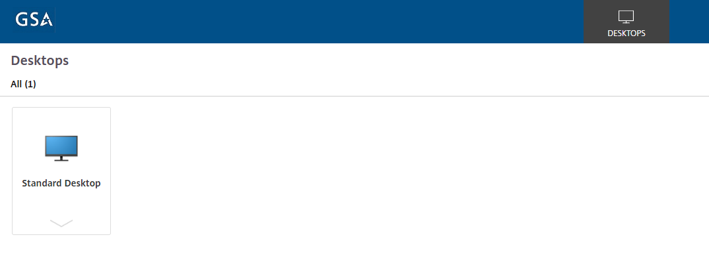

# [Archive Notice]
### As of 01.09.2024, this repository is no longer actively maintained and has been archived. The code is preserved in its current state for historical purposes and can be viewed or forked, but no further updates or changes will be made.

### You may consider checking out [px-benefit-finder](https://github.com/GSA/px-benefit-finder) for further development on this project.


# Benefit Finder custom module

Docs to be written

## How to Clone the PX-BEARS-DRUPAL Repository with usagov-2021 Submodule

This guide will walk you through the process of cloning the **_PX-BEARS-DRUPAL_** repository that includes a submodule. Submodules are repositories embedded within another repository, allowing you to include external dependencies or shared code as part of your project. When you clone such a project, by default you get the directories that contain submodules, but none of the files within them yet.

To clone the repository with a submodule, follow these steps:

1. Open your command line or terminal.

2. Navigate to the directory where you want to clone the repository. You can use the cd command to change directories. For example, cd Documents/Projects.

3. Use the following command to clone the main repository:

```
git clone git@github.com:GSA/px-bears-drupal.git
```

4. Once the cloning process completes, navigate into the cloned repository's directory using the cd command.

```
cd px-bears-drupal
```

5. usagov-2021 directory is there but empty. You must run the following two commands to initialize your local configuration file and fetch all the data from that project.

```
git submodule init
git submodule update
```

6. You have now successfully cloned the repository with a submodule. You can work with the main repository and its submodule as separate entities.

7. If you've already cloned a repository with submodules and want to update them, follow these steps:

   a. Navigate to the main repository's directory using the command line.
   b. Run the following command to update the main repository along with its submodules:

```
git pull --recurse-submodules
```

This command updates the main repository and its submodules to the latest commit.

# Accessibility Statement

We are committed to making our site accessible to all visitors. Our ongoing accessibility effort works towards conforming to Web Content Accessibility Guidelines (WCAG) version 2.1, level AA criteria and by performing regular automatic and manual testing audits.

# Local Development Environment

### Get USAgov code

```
git clone git@github.com:usagov/usagov-2021.git poc
cd poc
```

### Get USAgov code

Set up local development site following README.md.

### Get a Database Dump

1. Make sure you login cloud.gov on your terminal and target your org and space.

```
cf login -a api.fr.cloud.gov --sso
```

2. Change directory to where the script lives.

```
cd bin/cloudgov
```

3. Execute the following script.

```
./db-backup.sh
```

### How to use awscli commands for s3 

1. Make sure you login cloud.gov on your terminal and target your org and space.

```
cf login -a api.fr.cloud.gov --sso
```

2. Change directory to where the script lives.

```
cd bin/cloudgov
```

3. Export the bucket name in your terminal

```
export bucket_name=storage or export bucket_name=dbstorage 
```

4. Execute the following script. Make sure you `source` it!

```
source ./cloudgov-aws-creds.sh 
```
5. If you see the script finds a key and deletes it; make sure you run it again to create the key again. If the script finds a key, it will delete it.

You'll see either of the below messages after running it. 

```
Getting bucket credentials...
Key found. Deleting...

or

Getting bucket credentials...
Key not found. Creating...
```
6. Start using `aws s3` commands like below:

```
aws s3 ls s3://${AWS_BUCKET}/
```

7. Run it again after using it to delete the service-key.


# VDI Login Guide for the BEARS Team Members

## What is VDI?

The Virtual Desktop Infrastructure (VDI) is a technology that allows you to access a remote desktop environment from your local device. This is particularly useful for accessing GSA resources and applications securely from outside the GSA network.

## Steps to Login

1. Access https://secureauth.gsa.gov/secureauth14/, authenticate yourself with your GSA Credentials and get the TOKEN provided.

2. In a different browser, access the Citrix VDI at https://vdi.anywhere.gsa.gov/ and make sure see the below screen:


3. Enter your GSA Username and Password as well as the TOKEN you get from the 1st step above.

4. The VDI Desktops you have available will be presented to you after you successfully login. Click on the monitor icon for the VDI desktop you wish to launch.



5. You will notice a file downloaded in your browser. Click on the ^ to the right of the file name and select `Always open files of this type`.

6. Click on the monitor icon for the Desktop you want to launch. This time (and going forward) the Desktop should launch without showing a downloaded file.

## Additional Info

You may get additional information about the VDI and the Citrix (a Windows virtual desktop client) app from the TTS Handbook at https://handbook.tts.gsa.gov/tools/virtual-desktop/.

## Tips

To move files between your laptop and your Citrix desktop, use Google Drive. You can use Chrome in the Citrix desktop to download and upload files.
